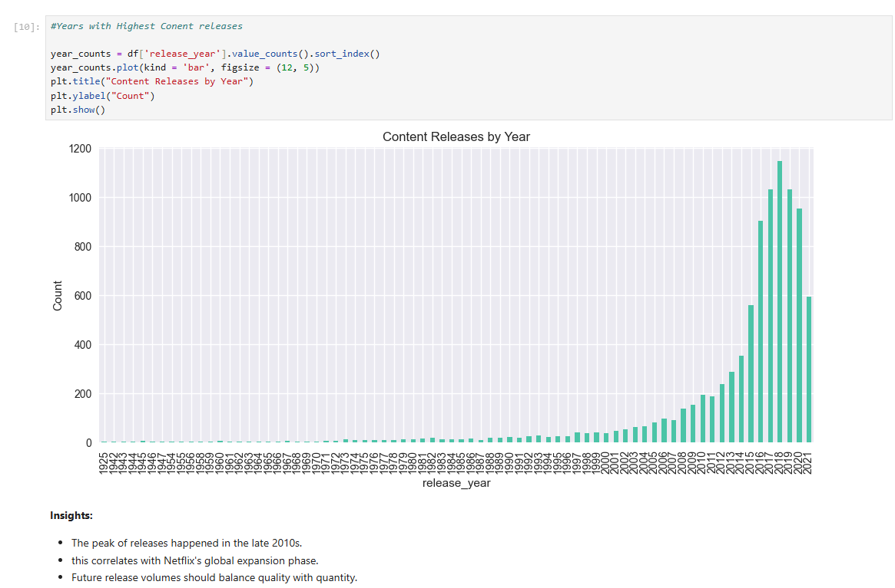
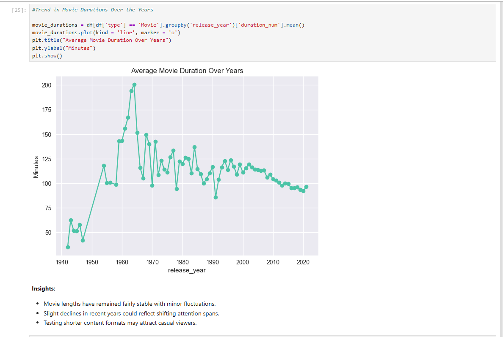
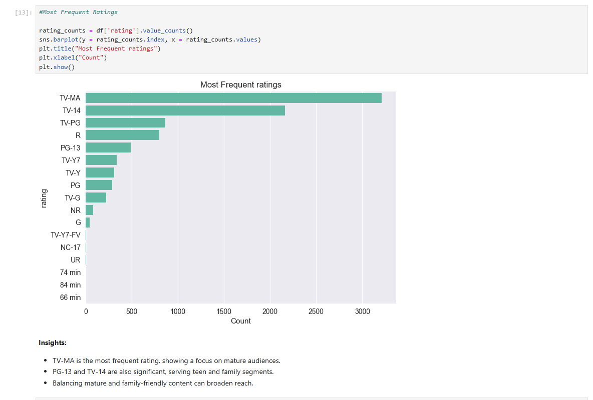

# 🎬 Netflix Data Analysis

## 📌 Project Overview

This project explores trends in Netflix's global content library using data analysis and visualization techniques.
The goal of the project is to understand how Netflix’s content has evolved over time by analyzing factors such as release trends, ratings distribution, movie durations, and content types.

Using Python-based data analysis tools, the dataset of approximately **8,000 Netflix titles** was cleaned, explored, and visualized to uncover meaningful insights about Netflix's content strategy.

---

## 🎯 Objectives

The main objectives of this analysis are:

* Identify trends in **content releases over the years**
* Analyze **movie duration trends**
* Examine **distribution of content ratings**
* Explore patterns in Netflix’s content production
* Generate insights about audience targeting and platform strategy

---

## 📂 Dataset

The dataset used in this project is the **Netflix Titles Dataset** available on Kaggle.

It contains information about Netflix movies and TV shows including:

* Title
* Type (Movie or TV Show)
* Director
* Cast
* Country
* Release Year
* Rating
* Duration
* Genre
* Date Added

Dataset Source: Kaggle – Netflix Titles Dataset

---

## 🛠 Tools & Technologies

* **Python**
* **Pandas** – Data cleaning and manipulation
* **NumPy** – Numerical operations
* **Matplotlib** – Data visualization
* **Seaborn** – Statistical visualization
* **Jupyter Notebook** – Interactive analysis environment

---

## 📊 Key Analyses Performed

### 1️⃣ Content Releases Over Time

This analysis explores how the number of Netflix titles released has changed across different years.

Key observation:

* Content releases increased rapidly in the **late 2010s**, reflecting Netflix's global expansion and increased investment in original content.

Example visualization:



---

### 2️⃣ Movie Duration Trends

This analysis investigates how the **average duration of movies** has changed over time.

Key observation:

* Movie durations have remained **relatively stable**, generally between **90–120 minutes**, with minor fluctuations across years.

Example visualization:



---

### 3️⃣ Distribution of Content Ratings

This analysis examines the most common content ratings on Netflix.

Key observation:

* **TV-MA** is the most common rating, indicating a large portion of content targeting mature audiences.
* **TV-14 and PG-13** also represent a significant portion of the catalog.

Example visualization:



---

## 📈 Key Insights

* The number of Netflix titles increased significantly during the **late 2010s**, aligning with Netflix's rapid global expansion.
* **TV-MA rated content dominates**, suggesting a strong focus on mature audiences.
* Movie durations remain relatively consistent, typically around **100 minutes**.
* Netflix maintains a diverse catalog with a mix of family-friendly and mature content.

---

## 📁 Repository Structure

```
Netflix-data-Analysis
│
├── notebooks/
│   └── netflix_analysis.ipynb
│
├── figures/
│   ├── content_release_year.png
│   ├── movie_duration_trend.png
│   └── ratings_distribution.png
│
├── requirements.txt
└── README.md
```

---

## 📚 Learning Outcomes

Through this project I learned:

* Performing **Exploratory Data Analysis (EDA)** on real-world datasets
* Cleaning and transforming data using **Pandas**
* Creating meaningful visualizations using **Matplotlib and Seaborn**
* Extracting insights from entertainment industry data

---

## 💡 Use Case

This analysis can help understand:

* Netflix's **content growth strategy**
* Audience targeting through **ratings distribution**
* Industry trends in **movie duration and production**

---

## 👩‍💻 Author

**Kirti**

Computer Science Student | Data Analytics & Machine Learning Enthusiast

Skills: Python • SQL • Data Visualization • Power BI • Machine Learning

